# 四、软件设计

本文以当前 HarmonyOS“办公健康管理系统”的实际代码为依据进行设计说明。系统面向日常办公健康场景，提供健康状态展示、健康洞察、专注计时、设备连接、健康提醒、目标管理和个人设置等功能。文中将已经接入的真实能力与尚处于原型展示阶段的能力明确区分，避免设计说明与系统实现不一致。

## 4.1 软件体系架构设计

### 4.1.1 功能模块结构图

#### 1. 设计目标

根据系统功能性需求，办公健康管理系统需要支持以下主要业务：

1. 展示设备连接状态、健康评分、久坐、环境和专注等首页摘要。
2. 对健康、环境、运动和设备数据进行分类展示与趋势分析。
3. 提供番茄钟、专注计时、专注统计和历史记录能力。
4. 通过蓝牙发现、连接办公健康终端，并接收或发送设备数据。
5. 配置久坐、饮水、远眺、通风等健康提醒。
6. 管理每日健康目标，并展示智能建议。
7. 管理个人资料、设备、数据、隐私和健康设置。
8. 为各功能模块提供数据中心、公共组件和本地持久化等支撑能力。

系统还需要满足以下非功能性需求：

- **易用性**：使用统一的底部导航和卡片式界面，降低功能查找成本。
- **可维护性**：按页面、组件、模型、服务和数据仓库划分职责，减少模块耦合。
- **可靠性**：对本地数据进行校验和默认值回退，对 BLE 和存储异常进行捕获。
- **可扩展性**：通过 Repository、Port 和回调接口隔离具体实现，便于后续替换数据源。
- **可测试性**：将路由、校验和数据规则放入纯 ArkTS 模型，通过 Hypium 执行主机单元测试。
- **兼容性**：系统目标 SDK 为 HarmonyOS 6.1.0（API 23），兼容 HarmonyOS 6.0.0（API 20）。
- **隐私性**：个人资料和专注数据优先保存在设备本机，当前版本不依赖云端账号服务。

#### 2. 功能模块划分

系统划分为八个主要功能模块：

| 模块 | 主要职责 |
|---|---|
| 首页总览模块 | 展示设备状态、健康评分、健康指标、智能建议和今日目标 |
| 健康洞察模块 | 展示久坐、环境、健康、运动和设备等分类数据及分析结果 |
| 专注管理模块 | 提供番茄钟、计时控制、专注统计、历史记录和配置保存 |
| 我的与设置模块 | 管理个人资料、健康设置、数据、设备、隐私、帮助与产品信息 |
| 设备连接模块 | 完成 BLE 扫描、连接、特征发现、数据发送、通知接收和断开 |
| 健康数据中心模块 | 统一保存、规范化、查询健康数据和提醒配置 |
| 健康提醒模块 | 管理久坐、饮水、远眺、通风提醒及免打扰时间 |
| 目标与建议模块 | 管理今日目标、目标设置和智能健康建议详情 |

#### 3. 功能模块结构图

```mermaid
flowchart TB
    SYS[办公健康管理系统]

    SYS --> HOME[首页总览模块]
    SYS --> INSIGHT[健康洞察模块]
    SYS --> FOCUS[专注管理模块]
    SYS --> MINE[我的与设置模块]
    SYS --> DEVICE[设备连接模块]
    SYS --> DATA[健康数据中心模块]
    SYS --> REMINDER[健康提醒模块]
    SYS --> TARGET[目标与建议模块]

    HOME --> H1[设备连接状态]
    HOME --> H2[健康评分]
    HOME --> H3[久坐/环境/专注指标]
    HOME --> H4[智能建议]
    HOME --> H5[今日目标]

    INSIGHT --> I1[久坐洞察]
    INSIGHT --> I2[环境洞察]
    INSIGHT --> I3[健康报告]
    INSIGHT --> I4[趋势与统计]

    FOCUS --> F1[番茄计时]
    FOCUS --> F2[开始/暂停/结束]
    FOCUS --> F3[专注统计]
    FOCUS --> F4[历史记录]

    MINE --> M1[个人资料]
    MINE --> M2[健康设置]
    MINE --> M3[数据管理]
    MINE --> M4[设备管理]
    MINE --> M5[系统与隐私]
    MINE --> M6[帮助与反馈]
    MINE --> M7[关于我们]

    DEVICE --> D1[BLE 扫描与连接]
    DEVICE --> D2[设备详情]
    DEVICE --> D3[数据收发]

    DATA --> C1[健康数据存储]
    DATA --> C2[数据规范化]
    DATA --> C3[时间范围查询]

    REMINDER --> R1[提醒开关]
    REMINDER --> R2[提醒配置]
    REMINDER --> R3[免打扰时间]

    TARGET --> T1[目标设置]
    TARGET --> T2[建议详情]
```

**图 4-1 办公健康管理系统功能模块结构图**

### 4.1.2 系统架构图

#### 1. 架构模式

系统整体采用“分层架构 + 组件化界面 + 功能模块化”的设计方式。应用入口模块 `entry` 负责主界面、洞察、设备、提醒、数据中心和“我的”等功能；`feature_focus` 以独立 HAR 模块实现专注功能；`shared` 模块定义跨功能共享的数据模型和端口。

系统由上至下划分为五层：

1. **界面展示层**：使用 ArkUI 声明式组件构建首页、洞察、专注、“我的”和设置页面。
2. **应用协调层**：负责应用启动、Tab 切换、页面路由、功能内部导航和 ViewModel 状态协调。
3. **业务服务层**：负责个人资料校验、专注计时规则、提醒处理和业务数据转换。
4. **数据访问层**：负责 DataCenter、本地 Preferences 和 Repository 的读写。
5. **设备与系统能力层**：提供 HarmonyOS 运行环境、BLE、ArkData Preferences 和系统资源能力。

#### 2. 各层职责

| 架构层 | 主要构件 | 职责 |
|---|---|---|
| 界面展示层 | `Index`、`Insight`、`FocusPage`、`MineRoot`、各 Page/Component | 展示数据、接收用户输入、触发用户命令 |
| 应用协调层 | `EntryAbility`、Tab 状态、`NavPathStack`、`FocusViewModel` | 初始化系统、协调页面状态、管理导航和功能生命周期 |
| 业务服务层 | `MineProfileService`、`FocusService`、`ReminderService`、模型函数 | 数据校验、计时规则、提醒规则和业务流程处理 |
| 数据访问层 | `DataCenter`、`FocusRepository`、`PreferencesMineProfileRepository` | 本地数据读写、健康数据查询、Repository 实现 |
| 设备与系统能力层 | `BleService`、HarmonyOS BLE、Preferences、资源系统 | 设备通信、本机存储、系统权限和资源访问 |

#### 3. 构件协作关系

- `EntryAbility` 在应用窗口创建时初始化 `DataCenter`，再加载 `pages/Index`。
- `Index` 作为当前应用组合入口，创建首页、洞察、专注和“我的”四个 Tab。
- 首页通过公共卡片组件展示数据，通过回调或路由进入提醒、设备、建议和目标页面。
- `Insight` 从 `DataCenter` 查询健康数据，并按照不同时间范围生成展示结果。
- `FocusPage` 通过 `FocusViewModel` 调用 `FocusService` 和 `FocusRepository`。
- `MineRoot` 使用 `Navigation + NavPathStack` 管理“我的”内部二级页面。
- `BleService` 接收设备数据后交给 `DataCenter` 解析和保存；提醒服务可以通过 `BleService` 向设备发送提醒配置。
- `Preferences` 保存个人资料、专注状态、专注历史和提醒配置等本机数据。

#### 4. 系统分层架构图

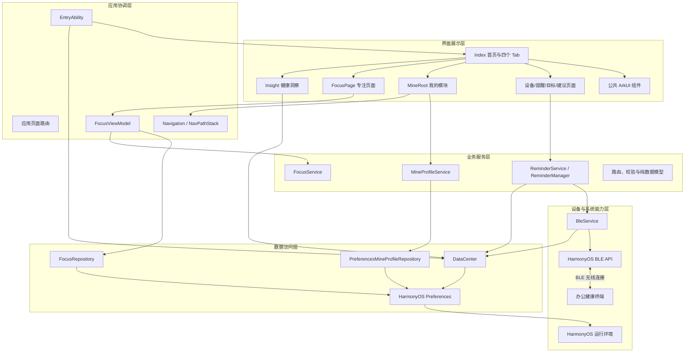

**图 4-2 办公健康管理系统分层架构图**

### 4.1.3 子系统架构图

#### 1. “我的”子系统

“我的”子系统采用页面、组件、模型、Service 和 Repository 分层。`MineRoot` 是该子系统唯一对外入口，负责导航编排、响应式状态和跨边界事件转发。

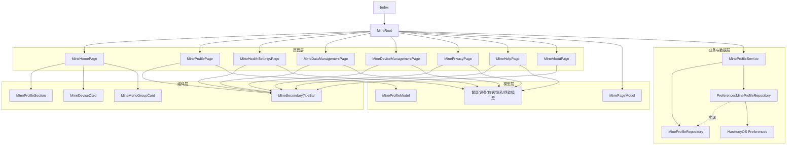

**图 4-3 “我的”子系统架构图**

“我的”子系统的主要设计模式包括：

- **组件组合模式**：首页由个人资料、设备和菜单组件组合。
- **分层模式**：页面、模型、服务和仓库各自承担单一职责。
- **Repository 模式**：业务层只依赖数据访问接口，不直接依赖 Preferences。
- **依赖倒置原则**：`MineProfileService` 依赖 `MineProfileRepository` 接口。
- **回调机制**：子组件通过回调向 `MineRoot` 上报点击、返回和保存事件。

#### 2. 专注子系统

专注子系统位于独立的 `feature_focus` HAR 模块中，采用类似 MVVM 的状态管理方式：

- `FocusPage` 和组件负责界面展示。
- `FocusViewModel` 保存运行状态并协调业务流程。
- `FocusService` 实现专注阶段和计时规则。
- `FocusRepository` 使用 Preferences 保存会话状态、历史记录和配置。
- `FocusSummaryPort` 为其他模块读取专注摘要提供稳定接口。

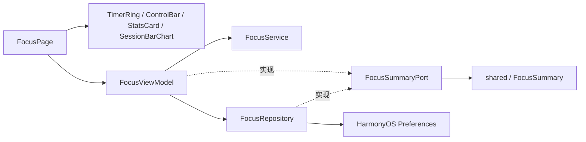

**图 4-4 专注子系统架构图**

#### 3. 设备与健康数据子系统

设备与健康数据子系统负责连接办公健康终端、收发 BLE 数据、规范化设备数据并向洞察和提醒功能提供统一数据。

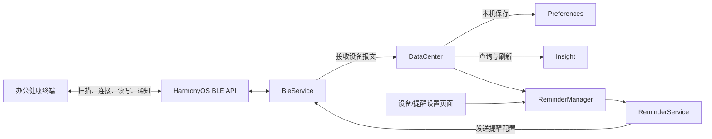

**图 4-5 设备与健康数据子系统架构图**

设备数据的主要处理流程为：

```text
办公健康终端
→ HarmonyOS BLE API
→ BleService 接收字符串报文
→ DataCenter 解析键值数据
→ 规范化时间戳和健康指标
→ 保存到本机 Preferences
→ Insight 查询并刷新界面
```

### 4.1.4 系统部署模型

#### 1. 部署节点

当前系统采用端侧部署方式，不依赖云端服务器。主要运行节点如下：

| 节点 | 基本配置与要求 | 部署内容 |
|---|---|---|
| HarmonyOS 手机或模拟器 | HarmonyOS 6.0.0（API 20）及以上，具备应用运行和本地存储能力 | `entry` HAP、`feature_focus` HAR、`shared` HAR、ArkUI 页面、业务服务 |
| 手机本地存储 | HarmonyOS ArkData Preferences | 个人资料、专注会话、提醒配置和健康数据 |
| 办公健康终端 | 支持 BLE GATT，与系统约定服务 UUID、通知特征和写入特征 | 采集健康/环境数据，接收提醒或控制信息 |
| 开发与构建节点 | Windows、DevEco Studio、HarmonyOS SDK 6.1.0、Hvigor | 源码编辑、主机测试、HAP 构建和设备调试 |

#### 2. 节点连接方式

- HarmonyOS 手机与办公健康终端之间通过 BLE GATT 无线连接。
- 应用内部模块通过 ArkTS 方法调用、回调、接口和模块依赖通信。
- 应用通过 ArkData Preferences 访问手机本地存储。
- 开发节点通过 DevEco Studio 调试连接向手机或模拟器安装 HAP。
- 当前版本没有云端服务器、Web 服务或远程关系型数据库。

#### 3. UML 部署图

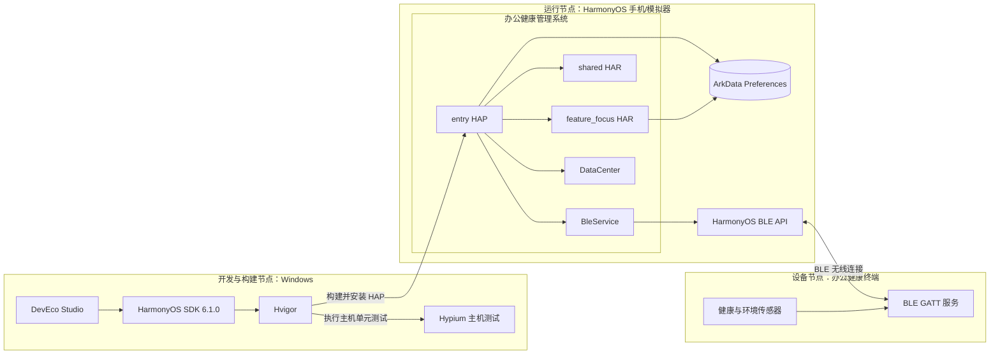

**图 4-6 办公健康管理系统部署图**

## 4.2 用户界面设计

### 4.2.1 界面定义汇总表

当前系统不包含账号注册和用户登录功能，应用启动后直接进入主界面。因此，本项目不设计登录页面，个人身份信息仅以本机个人资料形式保存。

| 模块名 | 界面名称 | 界面标识/代码位置 | 功能描述 |
|---|---|---|---|
| 应用入口 | 主界面 | `pages/Index` | 承载四个底部 Tab、首页内容和应用级页面跳转 |
| 首页总览 | 首页 | `Index` 中首页 `TabContent` | 展示设备状态、健康评分、指标、建议和今日目标 |
| 健康洞察 | 洞察 | `pages/Insight.ets` | 展示久坐、环境、健康、运动和设备数据 |
| 专注管理 | 专注 | `feature_focus/pages/FocusPage.ets` | 番茄钟、计时控制、专注统计和会话记录 |
| 我的与设置 | 我的首页 | `features/mine/pages/MineHomePage.ets` | 展示资料、设备卡片和功能菜单 |
| 设备连接 | 设备详情 | `pages/Setting` | 查看设备信息、连接状态和设备功能入口 |
| 健康提醒 | 提醒设置 | `pages/ReminderSetting` | 配置久坐、饮水、远眺和通风提醒 |
| 健康提醒 | 免打扰设置 | `pages/QuietTimeSetting` | 配置提醒免打扰时间 |
| 目标管理 | 目标设置 | `pages/TargetSetting` | 编辑和管理今日目标 |
| 健康建议 | 建议详情 | `pages/AdviceDetail` | 展示健康建议的详细说明 |
| 我的与设置 | 个人资料 | `MineProfilePage.ets` | 编辑昵称和个性签名并保存到本机 |
| 我的与设置 | 健康设置 | `MineHealthSettingsPage.ets` | 设置健康目标和提醒开关 |
| 我的与设置 | 数据管理 | `MineDataManagementPage.ets` | 展示数据摘要和同步、备份原型操作 |
| 我的与设置 | 设备管理 | `MineDeviceManagementPage.ets` | 查看设备快照和连接设置 |
| 我的与设置 | 系统与隐私 | `MinePrivacyPage.ets` | 管理隐私控制项和查看数据说明 |
| 我的与设置 | 帮助与反馈 | `MineHelpPage.ets` | 查看 FAQ、选择反馈分类并填写反馈 |
| 我的与设置 | 关于我们 | `MineAboutPage.ets` | 展示版本、产品介绍和版权信息 |

### 4.2.2 界面设计

#### 1. 界面设计原则

系统界面遵循以下设计原则：

- **一致性**：主界面使用统一底部导航、背景色、卡片圆角和间距。
- **信息层次**：重要健康状态置于首页，详细趋势和配置进入二级页面。
- **操作可见性**：可点击卡片使用箭头、按钮或明显的操作区域。
- **状态反馈**：保存、同步、连接和表单操作提供文字或状态提示。
- **小屏适配**：长内容使用 `Scroll`，标题栏和底部导航保持稳定。
- **组件复用**：设备卡片、指标卡片、菜单卡片和二级标题栏采用独立组件。

#### 2. 主界面概念设计

主界面包含静态元素、动态元素、用户输入元素和用户命令元素：

| 元素类别 | 界面元素 |
|---|---|
| 静态元素 | 页面背景、卡片标题、图标、单位、说明文字 |
| 动态元素 | 设备连接状态、健康评分、健康指标、目标完成状态、专注计时 |
| 用户输入元素 | 开关、文本输入框、目标调整按钮、反馈文本框 |
| 用户命令元素 | 底部 Tab、设置按钮、提醒按钮、卡片点击、保存和返回按钮 |

主界面采用四个底部 Tab：

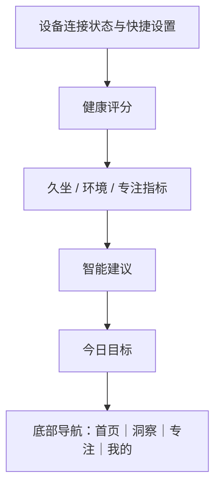

**图 4-7 系统主界面示意图**

> 本图用于说明首页的信息层次；实际报告可另附首页真机或模拟器截图，作为界面实现的验证材料。

#### 3. 主界面设计类图

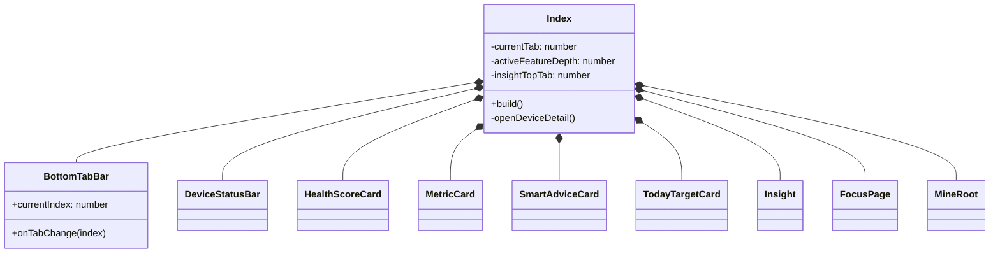

**图 4-8 主界面设计类图**

#### 4. 健康洞察界面

洞察界面用于集中展示健康与设备数据，主要包括：

- 顶部洞察分类 Tab。
- 当前指标值和状态说明。
- 日、周、月等时间范围。
- 趋势图、统计数据和健康建议。
- 从 `DataCenter` 读取并整理后的健康记录。

该页面以输出和数据浏览为主，用户主要通过顶部 Tab 和时间范围选择进行交互。

#### 5. 专注界面

专注界面主要包括：

- 圆形计时区域。
- 开始、暂停、继续和结束控制。
- 番茄钟完成数量。
- 专注总时长。
- 专注历史柱状图。

计时状态由 `FocusViewModel` 管理，界面通过响应式状态自动刷新。

#### 6. “我的”界面

“我的”首页主要包含：

- 个人资料区域。
- 办公健康终端设备卡片。
- 健康设置、数据管理、设备管理和系统与隐私菜单。
- 帮助与反馈、关于我们菜单。

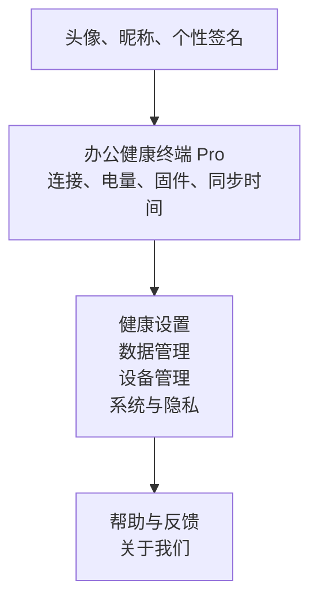

**图 4-9 “我的”首页示意图**

> 本图用于说明“我的”首页的信息层次；实际报告可另附真机或模拟器截图，作为界面实现的验证材料。

#### 7. “我的”界面设计类图

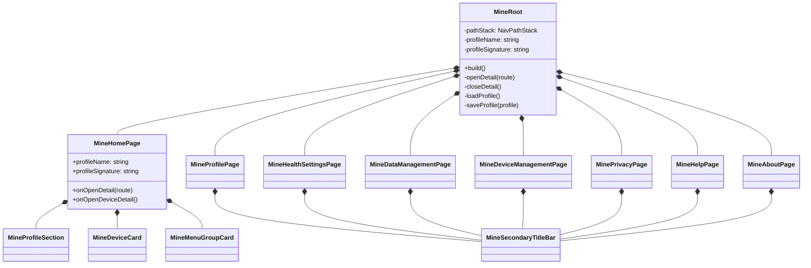

**图 4-10 “我的”界面设计类图**

### 4.2.3 用户界面间的跳转关系

#### 1. 页面跳转规则

系统存在三类导航方式：

1. **底部 Tab 导航**：在首页、洞察、专注和“我的”之间切换。
2. **应用级页面路由**：通过 `router.pushUrl()` 打开设备详情、提醒、目标和建议页面。
3. **功能内部导航**：“我的”使用 `Navigation + NavPathStack` 管理二级页面。

#### 2. 页面跳转关系图

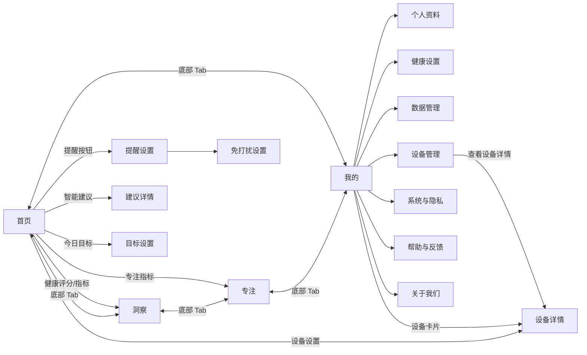

**图 4-11 用户界面跳转关系图**

#### 3. “我的”二级页面导航顺序图

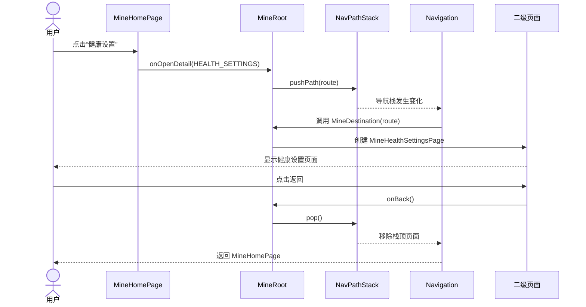

**图 4-12 “我的”二级页面导航顺序图**

#### 4. 个人资料保存顺序图

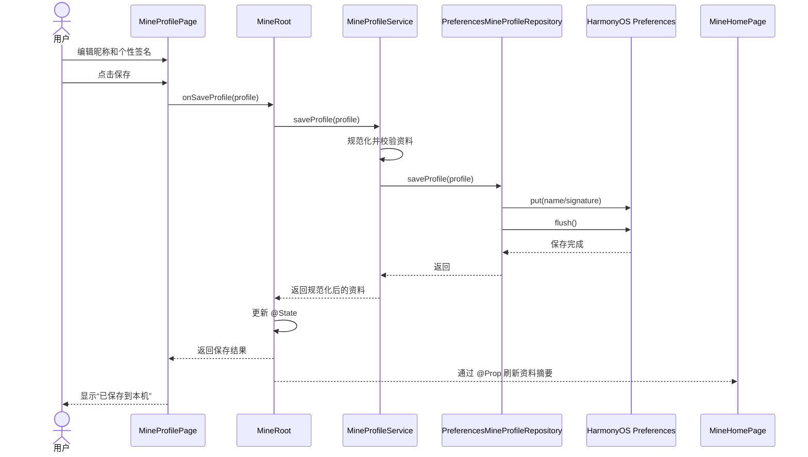

**图 4-13 个人资料保存顺序图**

#### 5. BLE 数据接收与界面刷新顺序图

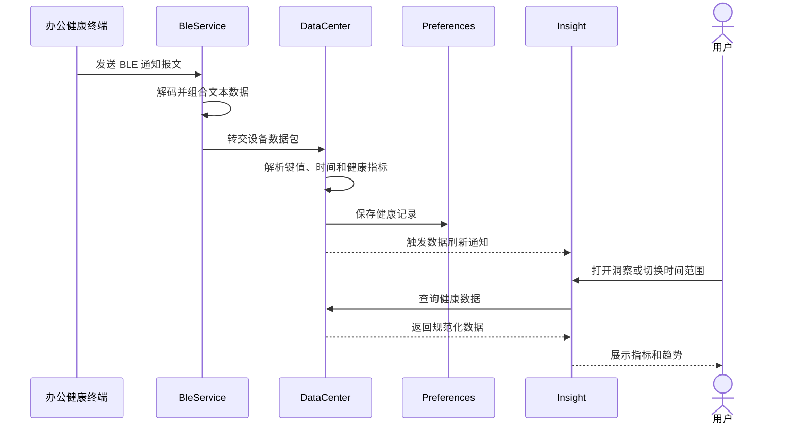

**图 4-14 BLE 数据接收与界面刷新顺序图**

## 本章小结

办公健康管理系统采用分层架构、组件化界面和功能模块化设计。`entry` 模块负责主应用与设备健康能力，`feature_focus` 模块独立实现专注功能，`shared` 模块提供跨模块端口和模型。系统通过 ArkUI 响应式组件完成界面展示，通过路由、回调和 `NavPathStack` 管理页面交互，通过 Service 和 Repository 隔离业务逻辑与本机存储，并通过 BLE、DataCenter 和 Preferences 建立办公健康终端到应用界面的数据链路。

当前版本以手机端和办公健康终端的端侧协作为主，不依赖云端服务器。“我的”个人资料、专注记录、提醒配置和健康数据已经具备本机数据访问结构；部分隐私开关、数据导出、反馈提交和设备配对操作仍属于原型交互，后续可在现有分层结构中继续接入真实 Repository、数据库或网络服务。
